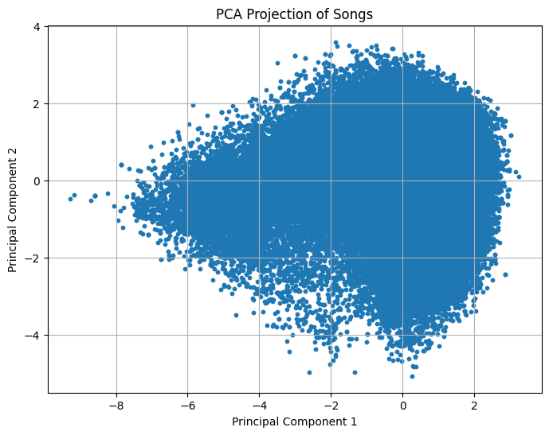
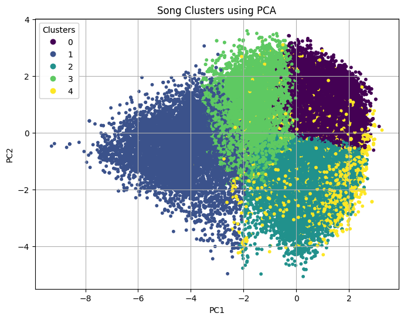

# 🎵 Eigenvalues & Eigenvectors in AI


### Tuwaiq Academy – Linear Algebra Unit 2 Project

**Group 5**


This project demonstrates how Eigenvalues and Eigenvectors are used in Artificial Intelligence and data analysis using a real-world dataset from Spotify.

The project explores the mathematical foundations of eigenvalues and eigenvectors and applies them to Principal Component Analysis (PCA) and clustering techniques to analyze music features.

---

# 📌 Project Overview

This project demonstrates how **Eigenvalues and Eigenvectors** are used in **Artificial Intelligence and data analysis** using a real-world dataset from **Spotify**.

The project connects **Linear Algebra concepts** with practical AI applications such as:

* Principal Component Analysis (PCA)
* Dimensionality Reduction
* Clustering using K-Means

The goal is to understand how mathematical concepts like:

```
AX = λX
```

help analyze high-dimensional datasets used in Artificial Intelligence.

---

# 📊 Dataset

**Spotify Tracks Dataset**

Source:
[https://www.kaggle.com/datasets/yashdev01/spotify-tracks-dataset](https://www.kaggle.com/datasets/yashdev01/spotify-tracks-dataset)

Dataset Information

| Property      | Value   |
| ------------- | ------- |
| Songs         | 114,000 |
| Genres        | 125     |
| Features Used | 10      |

### Features Used

```
danceability
energy
loudness
speechiness
acousticness
instrumentalness
liveness
valence
tempo
duration_ms
```

These features represent different musical characteristics of songs.

---

# 🧠 Mathematical Concepts

## Eigenvalues (λ)

Eigenvalues measure **how much variance exists in a specific direction**.

* Large λ → important direction in the dataset
* Small λ → less important direction

---

## Eigenvectors (X)

Eigenvectors define the **direction in which the data spreads the most**.

Mathematically:

```
AX = λX
```

Where:

| Symbol | Meaning     |
| ------ | ----------- |
| A      | Matrix      |
| X      | Eigenvector |
| λ      | Eigenvalue  |

---

# 🔬 Principal Component Analysis (PCA)

PCA reduces the number of features while preserving the most important information.

### PCA Steps

1. Standardize the dataset
2. Compute covariance matrix
3. Calculate eigenvalues and eigenvectors
4. Sort principal components
5. Project data into lower dimensions

---

# 📐 Principal Directions

Principal directions represent the **eigenvectors of the covariance matrix**.
Each principal component indicates a direction where the data varies the most.

| Feature          | PC1       | PC2       | PC3       | PC4       | PC5       |
| ---------------- | --------- | --------- | --------- | --------- | --------- |
| danceability     | 0.246124  | 0.574759  | -0.087916 | -0.297117 | 0.251589  |
| energy           | 0.509168  | -0.276668 | -0.009548 | -0.180383 | -0.027775 |
| loudness         | 0.516954  | -0.078894 | -0.057594 | 0.002617  | -0.186764 |
| speechiness      | 0.100641  | 0.026988  | 0.641281  | -0.248258 | 0.544157  |
| acousticness     | -0.439341 | 0.296186  | 0.227289  | 0.308564  | 0.027705  |
| instrumentalness | -0.282407 | -0.305665 | -0.201594 | -0.496160 | 0.402351  |
| liveness         | 0.085135  | -0.232578 | 0.678626  | 0.089588  | -0.250225 |
| valence          | 0.295026  | 0.522029  | 0.021582  | 0.173981  | 0.087443  |
| tempo            | 0.189047  | -0.279982 | -0.155955 | 0.661712  | 0.609944  |

Interpretation:

* **PC1** is influenced mainly by energy and loudness
* **PC2** relates strongly to danceability and valence
* **PC3** is associated with speechiness and liveness
* **PC4** is dominated by tempo
* **PC5** combines tempo and speechiness effects

These directions represent the **main axes of variation in the dataset**.

---

# 📈 Explained Variance

Explained variance shows how much information each principal component preserves.

```
Explained Variance:
[0.31928144, 0.15850939, 0.13545804, 0.10119368, 0.09850895]
```

Interpretation:

* PC1 explains **31.9%** of the variance
* PC2 explains **15.8%**
* PC3 explains **13.5%**
* PC4 explains **10.1%**
* PC5 explains **9.8%**

---

# 📊 Total Variance Explained

```
Total Variance: 0.8129514930988642
```

This means:

* **81.3% of the total dataset information is preserved**
* The dataset was reduced from **10 features → 5 principal components**

This demonstrates that PCA successfully reduces dimensionality while preserving most of the important information.

---

# 📊 PCA Projection of Songs

This visualization shows songs projected into a **2D PCA space using PC1 and PC2**.




Songs that appear closer together have similar musical features.

---

# 🎧 Song Clusters using PCA

After dimensionality reduction, **K-Means clustering** was applied.

This visualization shows groups of similar songs.




Interpretation:

* Each color represents a cluster of songs
* Songs in the same cluster share similar audio characteristics
* PCA makes clustering easier and more efficient

---

# 📈 Results & Insights

* Eigenvalues reveal which directions contain the most information.

* Eigenvectors show relationships between song features.

* PCA successfully reduced dimensionality while preserving key patterns.

* Clustering revealed groups of similar songs based on audio characteristics.

---


# 🛠 Tools Used

| Tool         | Purpose              |
| ------------ | -------------------- |
| Python       | Programming          |
| NumPy        | Linear Algebra       |
| Pandas       | Data Analysis        |
| Scikit-Learn | PCA & KMeans         |
| Matplotlib   | Visualization        |
| SymPy        | Symbolic Mathematics |
| Kaggle       | Dataset              |
| GitHub       | Version Control      |

---

# 📂 Project Structure

```
Tuwaiq-Linear-Algebra
│
├── project_linear_algebra.ipynb
├── README.md
├── dataset
└── images
     ├── pca_projection.png
     └── song_clusters.png
```

---

# 👥 Team Members

Group 5

* Abdulmajeed Alshehri
* Abdullah Alkhurayjah
* Mohamed Alsomali
* Saad Alshahrani
* Nawaf Alorabi

---

# 📚 References

Spotify Dataset

[https://www.kaggle.com/datasets/yashdev01/spotify-tracks-dataset](https://www.kaggle.com/datasets/yashdev01/spotify-tracks-dataset)

[https://malabdali.com/wp-content/uploads/2023/10/Abdi-EVD2007-pretty.pdf](https://malabdali.com/wp-content/uploads/2023/10/Abdi-EVD2007-pretty.pdf)

[https://en.wikipedia.org/wiki/Eigenvalues_and_eigenvectors](https://en.wikipedia.org/wiki/Eigenvalues_and_eigenvectors)

[https://www.geeksforgeeks.org/engineering-mathematics/eigen-values/](https://www.geeksforgeeks.org/engineering-mathematics/eigen-values/)

[https://towardsdatascience.com/eigenvalues-and-eigenvectors-378e851bf372/](https://towardsdatascience.com/eigenvalues-and-eigenvectors-378e851bf372/)

[https://byjus.com/jee/eigenvalues-and-eigenvectors-problems-and-solutions/](https://byjus.com/jee/eigenvalues-and-eigenvectors-problems-and-solutions/)

---
